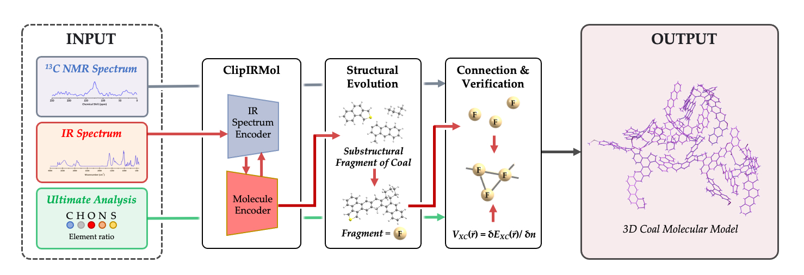

# GenCoal

GenCoal is an open-source software package in Python to generate coal molecular structures.



## Dependencies

To ensure the GenCoal software runs correctly, you will need to install the required dependencies. You can use the following steps to set up the environment using `conda` and `pip`.

### Step 1: Install Conda

If you haven't installed `conda` yet, download and install it from the [official Anaconda website](https://www.anaconda.com/products/distribution) or use [Miniconda](https://docs.conda.io/en/latest/miniconda.html) for a lighter version.

### Step 2: Clone the Repository

Clone the GenCoal repository to your local machine:

```bash
git clone https://github.com/GYLiGroup/GenCoal.git
cd GenCoal
```

### Step 3: Create a Conda Environment

Use `conda` to create and activate a new environment for GenCoal:

```bash
conda create --name gencoal_env python=3.9
conda activate gencoal_env
```

### Step 4: Install Dependencies

#### Install Conda Dependencies

Install all required packages listed in the `environment.yml` file:

```bash
conda env create -f environment.yml
```

This will install all the necessary dependencies, including `numpy`, `pandas`, `rdkit`, and others.

#### Install Pip Dependencies

Some additional dependencies are managed via `pip`. Install them using the `requirements.txt` file:

```bash
pip install -r requirements.txt
```

This will install any Python packages that were not covered by `conda`, such as specific libraries for machine learning or visualization.

### Step 5: Verify Installation

To ensure everything is set up correctly, you can run the following command to check if all dependencies are installed properly:

```bash
python -c "import pandas, numpy, torch, rdkit; print('All dependencies installed successfully!')"
```

If the command runs without errors, the environment is properly set up.

### Step 6: Running GenCoal

You can now run GenCoal to generate coal molecular structures:

```bash
python coal/main.py
```

## Contributing

If you have a suggestion or find a bug, please post to our `Issues` page on GitHub.

## Questions

If you are having issues, please post to our `Issues` page on GitHub.

## Developers

- Haodong Liu ([liuhaodong.ncst@foxmail.com](mailto:liuhaodong.ncst@foxmail.com))

## Publications

https://doi.org/10.1016/j.energy.2024.130856
